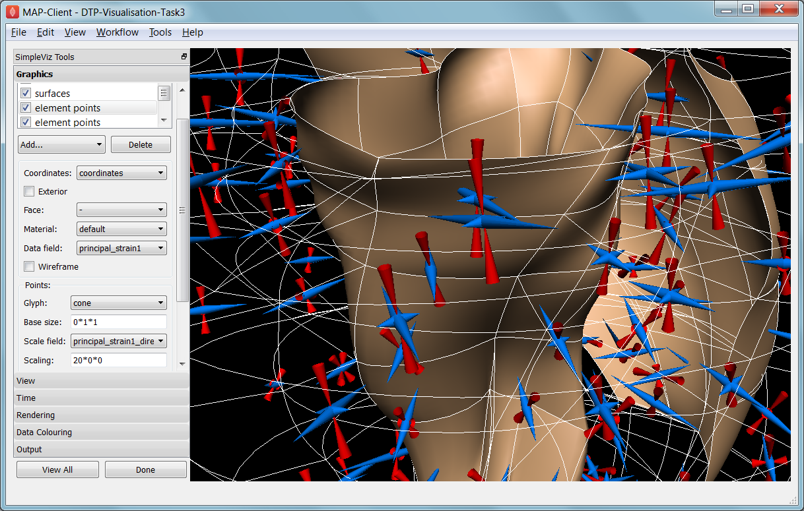
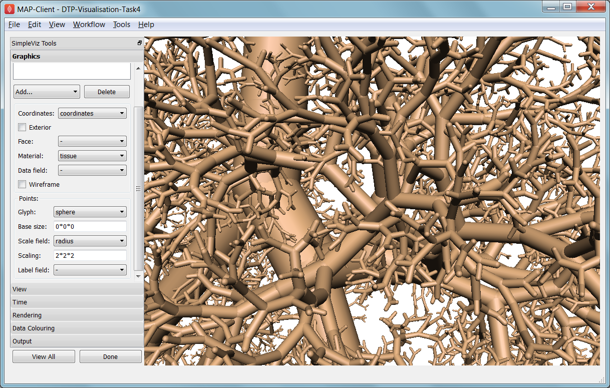
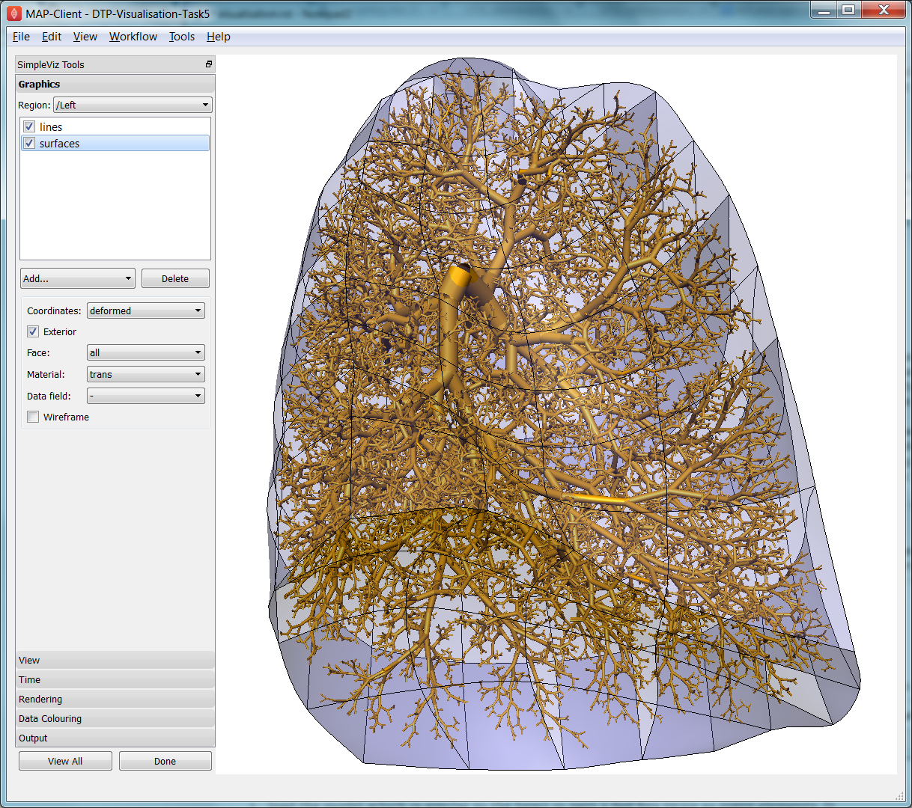
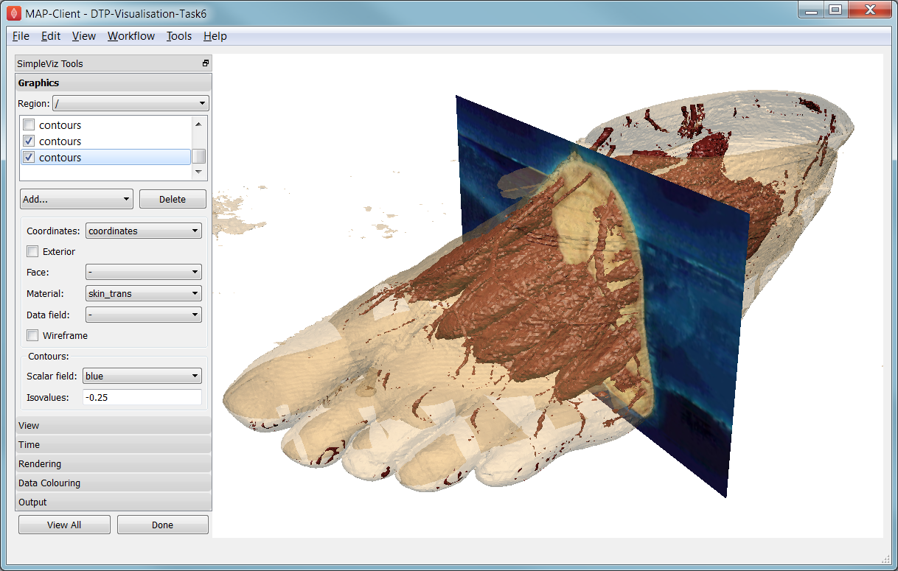

Visualisation
=============

This tutorial was created as part of the Computational Physiology module in the `MedTech CoRE <http://cmdt.org.nz>`_ Doctoral Training Programme. The tasks presented in this tutorial are designed to make the reader aware of key visualisation skills used in the context of computational physiology. We will demonstrate these skills across a range of spatial scales and visualisation techniques.

Overview
--------

Models, simulation results and image data in Computational Physiology are often three-dimensional, and may vary with time or other material or input parameters. We use visualisation to convert this raw modelling data into visual representations that illustrate the complexities of underlying biophysical behaviour in a manner that is consumable by the target audience.

This exploits humans' astounding visual capabilities, able to perceive three-dimensional objects and their spatial relationships from two-dimensional images of scenes with lighting/depth cues, possibly stereo, particularly when seen from multiple viewpoints.

Researchers need to perform interactive visualisation, alternately varying what is being spatially visualised and moving about the scene to view it from different distances and directions, and viewing changes with time. Such interaction is necessary to discover salient features in the dataset, since they may be deep within a 3-D model and hidden behind other structures, or happen in an instant of time.

One of the main challenges of visualisation is that typical output media such as documents and computer 
displays are inherently two-dimensional. We employ computer graphics rendering to make 2-D images 
from 3-D scenes, built up solely from point, line and triangle *primitives*. Visualisation algorithms are used to covert features of a model which may be any dimension into these primitives. Computer graphics rendering applies shading (colouring including with textures/images, lighting, translucency) to draw primitives out of coloured pixels on the output image, and combined with the ability to vary time and viewpoint (at interactive speeds due to the enormous processing power of graphics hardware) gives the resulting output depth and communicates temporal changes.

Often the final objective is to output one or more static 2-D images, a movie or increasingly a shareable interactive 3-D visualisation. These outputs are used for papers and theses, presentations and general publicity. It can't be over-estimated how important it is to develop these visualisation skills when working in Computational Physiology, and how effective they are in communicating results and engaging with your audience: *pretty pictures sell research*.

SimpleViz tool
--------------

This tutorial uses the *SimpleViz* MAP client plugin for interactive visualisation. Each tutorial task uses a simple workflow consisting of a File Chooser for specifying a loading script (which loads a model and sets up some initial graphics) which is passed to the SimpleViz step, as shown in  :numref:`fig_dtp_cp_vis_simpleviz_workflow`:

.. _fig_dtp_cp_vis_simpleviz_workflow:

.. figure:: _images/simpleviz-workflow.png
   :align: center
   :figwidth: 80%
   :width: 75%

   Visualisation workflow using SimpleViz in the MAP client framework.

As the name suggests, SimpleViz presents a simplified interface for performing key aspects of interactive visualisation including results output. As shown in :numref:`fig_dtp_cp_vis_simpleviz_viewpage` its interface consists of a large 3-D graphics view and a toolbar with a series of pages for performing key functions. These are described in the following tutorial tasks, however it is hoped that many features will be obvious, and you are encouraged to *play* and *have fun*.

Task 1: Viewing
---------------

Open the *DTP-Visualisation-Task1* workflow and execute it. This loads the heart model construction visualisation in SimpleViz (from the model construction tutorial) as in :numref:`fig_dtp_cp_vis_simpleviz_viewpage`.

.. _fig_dtp_cp_vis_simpleviz_viewpage:
.. figure:: _images/simpleviz-viewpage.png
   :align: center

   SimpleViz heart model construction visualisation, with view controls.

This is a made-up example for demonstrating how complex models are built out of simple shapes (finite elements), in this case cubes. Once you play around with it you will see how a good visualisation can explain complex behaviour with great efficiency.

The example supplies the coordinate locations of 60 elements at 4 times:

1. All elements converged to a single cube (time = 0.0)
2. The elements are exploded into a regular lattice and not connected (time = 0.2)
3. The elements are merged into a block mesh of 10x3x2 elements (time = 0.4). This stage shows that corners, edges and faces of touching elements have merged (except for those eventually on the right ventricle cavity -- these open up).
4. The block mesh is deformed into the heart model, merging into a ring where ends touch, closing the apex, and opening the right ventricle (time = 1.0)

At any time switch to the time page and move the time slider to animate the model which smoothly interpolates between the above times. Note that interpolation between times 0.4 and 1.0 is not appropriate for some outside elements which get very distorted, but it is good enough for this demonstration. The following section explains how to change your view of the model which you should be constantly doing when visualising models.

Before proceeding we need to explain some concepts in order to make sense of the following tasks. This model has a **domain** consisting of a mesh of 60 cube-shaped elements which are eventually connected along certain faces. Over the domain we describe the **field** 'coordinates' which is a function mapping each of the elements' local 'xi' coordinates to their positions in the 3-D coordinate system; in this case the coordinates are interpolated from coordinates stored at discrete *node points* within the model, which can be visualised and labelled as described in task 2. In computational models there can be any number of fields defined over a domain, representing quantities ranging from material properties to the results of simulations. A key feature of visualisation is that separate fields can be used to set various visualisation attributes, including coordinates, colours, orientation and scaling, labels etc. creating an explosion in the number of permutations of possible graphics that can be displayed.

Manipulating the View
.....................

We can manipulate the view with mouse actions: clicking and dragging with the mouse in the graphics window area allows you to rotate, pan and zoom the view. The following table describes which mouse button controls which transformation.

============ ==============
Mouse Button Transformation
============ ==============
Left         Tumble/Rotate
------------ --------------
Middle       Pan/Translate
------------ --------------
Right        Fly Zoom
------------ --------------
Shift+Right  Camera Zoom
============ ==============

When we transform the view with the mouse you can see the corresponding settings change in SimpleViz' view page (see :numref:`fig_dtp_cp_vis_simpleviz_viewpage`). You can also directly enter values into the controls. Regular Fly Zoom moves the eye point closer to the lookat point. Camera Zoom changes the angle of view but the eye doesn't move; if you make a very wide angle of view and then move in close, it is like looking through a very wide angle lens. The Tumble/Rotate control rotates about an axis in the scene, like pulling on a tangent to a large sphere filling the window. Play with these controls until they make sense to you. If things start looking too weird, click the 'View All' button to restore a normal view.

In real life you can see from in front of your eyes to infinity, albeit not all in focus. In typical 3-D computer graphics everything is in focus, but you can only see a range of distances in front of your eye in the direction of the 'lookat point': between the near and far clipping plane distances. When you view the world in perspective mode (the default in SimpleViz), the part of space you see is called a *viewing frustum*, which is a pyramid seen from above but with its top chopped off at the near clipping plane. By turning off perspective you get a *parallel projection* where sizes of objects are unchanged by distance from the eye, like an extreme telephoto lens effect. Note that parallel projection uses the near and far clipping planes in exactly the same way.

Ideally we want to position the near plane just in front of everything that should be visible and position the far plane just behind everything that should be visible. The better the job we do of this the better the hidden graphics removal will work, which is important when making large high-quality, high-resolution images. SimpleViz sets the range more conservatively than this so that it doesn't need to change the ranges when objects are rotated out-of-plane. (You will notice in this example that multiple graphics drawn at the same depth appear to flash as they battle for which is in front and therefore seen. With lines and surfaces at the same depth the lines look like stitching; under the rendering page is a *perturb lines* option which brings the lines nicely in front. Try it out.)

As their names suggest, the clipping planes can also be used to good effect in hiding graphics that are in the way of what we want to see. Here we will use them to gain an insight into what graphics are actually on the screen.

On the view page, drag the near clipping plane until close parts of the model disappear; when you are close you can hover over the slider and rotate the mouse wheel which moves it with more precision. Similar clipping occurs if you zoom in close enough to the model since you can't see things behind you. The far clipping plane has a similar effect on the far side of the view.

With the front part of the model being clipped, rotate the view: you will see all the elements are hollow! This reinforces that only points, lines and triangles (surfaces) are ever drawn in computer graphics. Have a look at the list of graphics under the graphics page: it consists of lines and surfaces on the edges and faces of 3-D cube elements. You can assure yourself that the elements are 3-D by making other graphics such as elements points that are calculated in its interior; you'll need to hide the surfaces by un-checking the box next to the surfaces graphics on the list.

For the rest of this task use the viewing controls to look closely at how the bottom of the heart is merged to form an apex, and generally how the initially cube-shaped elements are distorted to make a physically realistic shape.

Task 2: Graphics and Image Output
---------------------------------

In this task we will create basic graphics to visualise a 3-D heart model, and output an image suitable for a publication. Open the *DTP-Visualisation-Task2* workflow and execute it. :numref:`fig_dtp_cp_vis_simpleviz_graphicspage_heart` shows the model visualised how we want at the end of the task, and shows the graphics page controls in SimpleViz.

.. _fig_dtp_cp_vis_simpleviz_graphicspage_heart:

.. figure:: _images/simpleviz-graphicspage-heart.png
   :align: center

   SimpleViz graphics page showing heart model ready for print output.

The graphics page lists all the individual graphics that make up the visualisation of the model. Each listed graphics item has a square checkbox that controls whether it is visible or not. The heart model is initially visualised with lines, surfaces and node points (drawn as spheres).

Graphics Types
..............

Following are all the main graphics types that can be created with SimpleViz:

  * **Lines**: Graphics made from 1-D elements or edges of higher dimensional elements. Drawn by default with line primitives, extra controls allow them to be shown as scaled cylinders.
  * **Surfaces**: Surface graphics generated from 2-D elements or faces of 3-D elements.
  * **Points**: Visualisations of discrete locations in the model. These are each drawn with the chosen *glyph* (standard shapes including point, sphere, arrow, cone etc.) which can be scaled, oriented and labelled by different fields in the model. Variants include *point* (a single point, e.g. for drawing the axes glyph at the origin), *node points* (points in the model at which parameters are stored for interpolation), *data points* (an additional set of points not used for interpolation), and *element points* (points sampled from the interior of elements, with extra controls for sampling).
  * **Contours**: For 3-D models, produces *iso-surfaces* at which the specified scalar field equals a chosen value or values. In 2-D domains, produces *iso-lines*.
  * **Streamlines**: visualisations of the path of a fluid particle tracking along a stream vector field specified for the specified length of time. Sampling and line attributes are also settable; different line shapes allow lateral directions or curl to be visualised.

All graphics share some common attributes, for example the field giving their coordinates, the material chosen to colour the graphics, and as appropriate, limiting to exterior or particular faces of parent elements. There is also a *data field* which is used to colour the graphics by the value of the chosen field, as described later.

Select the surfaces and change the material to 'blue'. Experiment with different materials, exterior state and face values for the lines and surfaces.

Point Glyphs and Scaling
........................

Select the node points and change the glyph (e.g. to 'cube_solid') and try different values for base size. Glyphs can be oriented and scaled by fields with the final sizes each given by::

   size = base_size + scaling*scale_field

If you want the glyph to be fixed size, give it a base size and either no scale field or zero scaling. If you want the size to be proportional to a field, give it zero base size, choose a scale field and a scaling value which specifies the length/diameter/size of the glyph (since they are all unit sized). If you want to visualise a vector, make the base size '0*width*width' and the scaling 'scale*0*0' to ensure the width is fixed and the length is proportional to the magnitude of the vector. 

Create new *element points* graphics via the 'Add...' pull down menu and change the label field to 'xi' to show the element's local coordinates at their respective centres. You may need to hide surfaces to see points inside elements. Change the number of divisions to 2 (interpreted as 2*2*2 in 3-D) and change the mode to 'cell_corners'. Be aware that if you label points with the coordinates for this model the values are in a prolate spheroidal coordinate system so will not match the common x, y, z coordinates.

Data Colouring
..............

Click 'Done' and restart Task2. Hide the node points. For the surfaces graphics, choose 'fibres' for the 'data field' (we will explain what this field represents later; here we are just treating it as an interesting field to colour graphics by). Go to the 'Data Colouring' page and click 'Autorange spectrum', then 'Add colour bar' to see the full range of values of 'fibres' over the drawn surfaces. Note that the colour bar is a special *point* graphics added to the graphics list.

Colouring by a field is a key method for visualising variation of solution values across visible parts of a model. You are free to arbitrarily set the range of data values mapped to colours. Enter minimum=0, and maximum=2.

Contours
........

Add *contours* graphics and choose scale field 'slice' and isovalues=0. The slice field is defined as a scalar (single component value) given by the plane equation Ax + By + Cz with the right-hand-side given by the isovalues. Experiment with other fields such as lambda, mu, theta (the prolate coordinates) and different isovalues such as 0.7 (or multiple comma-separated isovalues) for these fields.

Drawing contours/isosurfaces is one of the key techniques for visualising the interior of a 3-D model. Often there is a threshold value of a scalar field where interesting or problematic behaviour occurs: where stress exceeds what the material can handle, or where the electric potential of the heart cells rises to a point where the muscle contracts. In such cases a single image can often communicate the main features of what is happing at that time.

Always rotate, zoom and pan around to see what you have created.

Tessellation Quality
....................

On the contours graphics, restore the scalar field to 'slice' and the isovalues to '0'. Set the data field to 'fibres'. Tick the *wireframe* check box to see the outline of the actual triangles being drawn for the contours.

Change to the Rendering page of the tool bar and inspect the Tessellation divisions. The elements making up the model are divided into linear segments for graphics creation. The Minimum divisions is the number of divisions for a linear element, and these are multiplied by the Refinement factors for non-linear interpolation and coordinate systems. Hence in this example the heart elements are divided into 4 segments in each dimension.

Type '8' following by Enter in the Refinement control. You will see that all curved lines and surfaces suddenly look much smoother. Enter '1' to see how bad linear interpolation looks on these curved elements. Now Enter '16'; you will be asked to confirm this number since the 3-D elements are divided into 16*16*16 small cubes for generation of the contours, which for 60 elements requires evaluating the scalar field at 0.25 million locations, and more graphics means it may be considerably slower to generate graphics and even perceptably slower to draw on-screen. Zoom in and look around this fine visualisation.

The divisions are specified as the product of 3 numbers, one for each element 'xi' direction. Since the elements of this mesh are thinner and more simply described through the xi3 direction, enter 16*16*4 to see an almost identically high quality result with 1/4 of the calculations.

Tessellation quality is a compromise; use fewer divisions for interactive speed, and raise the number for high quality image output.

Streamlines
...........

Normally streamlines are used to visualise fluid flow, however muscle tissue is fibrous and to model its deformation and electrical conduction requires the orientation of these fibres to be described throughout the domain. The 'fibres' field describes the orientation of the muscle fibres, but also the lateral sheet direction and sheet normal. This field is suitable for visualisation with streamlines.

Hide the contours and create *streamlines*. Select streamlines vector field 'fibres', and set the time length to 100 to see many fibres drawn as lines. You're free to seed streamlines from multiple sampling points, but we'll stick with the default centre of each element. Now set the bases size to '1*0.2' and the line shape to 'square extrusion'. Set the material to 'silver'. This visualises not only the direction of the muscle fibres, but also the planes of muscle fibre sheets, which have different material properties to the sheet normals. Zoom in and have a close look at the resulting graphics.

Printed Output
..............

White or coloured graphics on a black background looks great on-screen but terrible on the printed page, plus it is a huge waste of ink/toner! On the view page change the background colour to '1,1,1' i.e. white. The problem now is that the white graphics are invisible over the white background! On the graphics page select the *lines* graphics and change the material to 'black'. Do the same to the *point* graphics used to show the colour bar, so the labels appear in black. We now have what we want on the printed page (admittedly in a more sophisticated graphics package we may want to make the lines thicker, and change the font, however SimpleViz hides these options).

Adjust the window to the size you want, and the orientation of the heart so it looks balanced. From the Output page of the toolbar, click on 'Save image...' and enter a name, say 'myheart.png'. From outside MAP Client / SimpleViz browse to the file location and have a look at the final output image, which is ready to put in your publication.

Task 3: Deformation Animation
-----------------------------

In this task we read a heart contraction simulation, visualise deformation and strains and output a 3-D animation to the web. Open the *DTP-Visualisation-Task3* workflow and execute it. :numref:`fig_dtp_cp_vis_simpleviz_deforming_heart` shows a close up of this model visualising strain tensors.

.. _fig_dtp_cp_vis_simpleviz_deforming_heart:

   Visualising strain tensors in the deforming heart.

This model's loader script defines a Lagrangian finite strain field using the rate of change of the coordinate field in deformed versus reference states. Eigenanalysis is performed to get principal strains and their directions, and these are used to scale and orient mirrored cone glyphs. The above figure shows that the first element points' cones are oriented with the first principal strain direction. Not shown in the SimpleViz interface are the mirror and signed scale options use to scale the cones and point them inwards in compression and outwards in extension. A special spectrum is used to show extension in blue and compression in red, using the first principal strain as the data field.

[At the end of this task, advanced users may want to look at the loader script to see how the time-varying model is loaded, how the additional fields are created by expressions, plus how the advanced visualisation options are set up. This example demonstrates that you don't need to be stuck looking at the results exported from your solver; additional fields for visualisation can be created from any mathematical or algorithmic transformation on the exported fields.]

Go to the time page of the toolbar and adjust time to observe the passive inflation and contraction phases of the deformation (the last phase was not solved and just interpolates back to the start). View the changing strains which show how the material deforms at those points. Change the glyph for each element points graphics to 'arrow_solid' and see how it looks. On the Rendering page change the circle divisions to 4, then 6 and back to 12 to see the effect on the quality of the arrows; the higher the number, the more time it takes to draw the graphics; this may not affect this smallish example, but try increasing the number of sampling divisions on all three element points graphics (to 3*3*3 or higher) to see if it has an effect, particularly when animating.

Making Web Animations
.....................

Hide all three element points and view the deformation. Change the surfaces to show all faces, with exterior on. Hide the lines. Look at how the ventricle twists as it contracts.

Traditionally we've produced movies to demonstrate dynamic behaviour, by writing a series of images at different times and using an external movie-maker tool to combine them into a movie file. However, these only show the results from a fixed direction or trajectory.

Here we are going to export an animated outside surface of the heart into 'ThreeJS' format for viewing in a web app (using WebGL). On the Output page, click on 'Save WebGL...', navigate to the 'export' folder as instructed by the tutor, choose a filename prefix e.g. 'defheart' and click 'Save'.

Now open a FireFox browser (other browsers are not yet properly supported) and load the following file from the above export folder, specifying the PATH and the inputprefix of your exported model::

  file:///PATH/export/sample_export.html?inputprefix=defheart

It should display the model as a slowly deforming heart, which you can view from different directions just as in SimpleViz. This technology is relatively new and there is still much to be exploited, but it shows one of the ways visualisations will be shared in the future.

Task 4 Lung Airways Network
---------------------------

In this task we read a model of the network of airways in both left and right lungs. The airways are one dimensional elements, but they have a radius field which is used to give them a three dimensional form. Open the *DTP-Visualisation-Task4* workflow and execute it; it's a large model and can take a while to load. :numref:`fig_dtp_cp_vis_simpleviz_airways` shows a close up of this model at the end of this task.

.. _fig_dtp_cp_vis_simpleviz_airways:

   Close-up of lung airways with spheres plugging gaps.

When initially loaded, the airways are drawn as lines with no indication of how thick they are. On the view page change the background colour to 1,1,1 and on the graphics page select the lines and change their material to 'tissue'. Choose scale field 'radius', and set the scaling to '2*2' to use it as a diameter. Change the line shape to 'circle extrusion', and after a pause the true-sized airways are shown. Explore the model up close.

One problem with the model is that each airway is a straight tube, which makes for gaps between them when they change direction. A 'cheap trick' solution is to draw a sphere at every node point. Add *node points* graphics, set the material to 'tissue', the scale field to 'radius', the scaling to '2*2*2', and the glyph to 'sphere'. That should close the gaps reasonably well. Sometimes it's necessary to be dirty to make a clean image!

For a very attractive view of the airways, select the lines graphics and set the data field to 'radius'. The default range of the spectrum from 0 to 1 looks much nicer than when it is autoranged.

For any of these models it may be helpful to see where the global x, y, z axes are. Add a new *point* graphics, set the material to 'black', change the glyph to 'axes_xyz' and set the base size to 50. Surprisingly, the origin is quite far from the model; you may need to zoom out or click on 'View All' to see the axes. From the relative size of the axes we can see that coordinate units are in millimetres.

Task 5 Embedded Airways
-----------------------

In this task we visualise a deforming left lung model (deflating from total lung capacity) with embedded airways. Open the *DTP-Visualisation-Task5* workflow and execute it; it's a large model and can take a while to load. :numref:`fig_dtp_cp_vis_simpleviz_embedded_airways` shows a close up of this model decorated as part of this task.

.. _fig_dtp_cp_vis_simpleviz_embedded_airways:

   Left Lung with embedded airways.

On loading you will see the airways as gold lines inside a lung volume mesh. The model is time-varying, so play with the time slider on the Time page to view the deformation (which is not quite as interesting as that of the heart). When looking at the list of graphics you'll be surprised to see an empty list! Above the list of graphics is a 'region chooser'. This model consists of two separate submodels, one for '/AirwaysLeft' and one for '/Left'. Each has its own domains and fields, plus the graphics used to visualise them.

We now decorate the combined model to match the above image. First, on the view page, set the background colour to 1,1,1. Next, on the graphics page, switch to region '/AirwaysLeft', select the lines and set scale field 'radius', scaling '2*2' and shape 'circle extrusion'. Switch to region '/Left', select lines and change the material to 'black'. Add surfaces, make them exterior and choose material 'trans', a special semi-transparent material created for this example.

You will find with the fully decorated model that animation with time is much slower, mostly because of the cost of building the 3-D airways. Reducing the circle divisions on the Rendering page can speed things up a little at some cost to image quality.

One interesting thing about this visualisation is the fact that the airways move with the deforming lung volume model because they are embedded at fixed element:xi locations within it. This is a technique for reducing the computation and storage costs of multi-scale models: time-varying coordinates need not be stored for the fine airways since they can get them from their host lung model.

A second interesting point is that the translucency effects are imperfect and 'patchy'. It actually takes some clever rendering to draw this perfectly, and SimpleViz does not present those options.

There are some other interesting fields in this model. Create contours of z = -100, with data field 'cmH2O' a pressure. You will see nothing until you hide the translucent surfaces. The order of drawing is important for simple translucency, so recreating the translucent surfaces after the isosurfaces works better. Once you can see the isosurfaces, autorange the spectrum under the Data Colouring page, and display the colour bar (changing its material to 'black' on the graphics page, under root region '/'). It was a surprise to the researcher that this field drops to zero in the centre of the lung, and may indicate an error. This goes to show how interactive visualisation plays a key role in checking the validity of computational physiology results.

On the 'Left' region you can also create *data points* with coordinate field 'stress_coordinates' and colour them by data field 'stressp'. The data points are also embedded in the lungs and field 'stressp' varies with time. You may need to hide other graphics to see these well. Play around with adjusting time and autorange the spectrum at different times in the Data Colouring page. Data points can be visualised with scaled glyphs just like node points.

Task 6 Image Fields and Texturing
---------------------------------

This task demonstrates how images can be used to colour, or *texture* graphics, and how images can be segmented into surfaces as contours of the image field. Open the *DTP-Visualisation-Task6* workflow and execute it. It may take a while to load since it contains a stack of images and some of the contours calculations take some time. :numref:`fig_dtp_cp_vis_simpleviz_footimage` shows a view of the model from later in this task. The image data is of the foot, cropped from the NLM Visible Human Project male dataset.

.. _fig_dtp_cp_vis_simpleviz_footimage:

   Segmented skin, muscles and vessels of the foot image.

Initially two perpendicular slices of the 3-D images -- contours of x and y -- are drawn, plus two contours graphics segmenting surfaces of the skin and interior red tissue including muscles and larger vessels. An initially hidden contours graphics shows segmented bone surfaces, but is not so clean and includes a lot of non-bone surfaces.

First hide the last two contours graphics and inspect the images drawn in the image block. Try different values of x and y contours, for example enter isovalues '120, 180' for the first contours (of x), and '120, 180, 240, 300' for the second contours (of y). This shows that the entire volume image is present and able to be shown over graphics. Note you can't currently set up these graphics via the SimpleViz interface as it doesn't have the *texture coordinates* field setting which tells the graphics which part of the image to draw at primitive vertices.

Restore contours to x=128.5, y=185.5, and then show the last two contours in the graphics list, the muscle and skin surfaces. To achieve these visualisations the loader script created fields 'mag_non_muscle' and 'blue' as expressions on the colour (in red, green, blue or RGB space). You can see that it is very clear on the images where the images are red and blue, so these work well.

Now switch to the Rendering page of the toolbar and see that only the minimum divisions, at '16*16*16' are used for this model. If you were to create new lines graphics you will see that the isosurfaces are calculated over a separate mesh, sized so that 16 image pixels cross each element. This means that the contours will be as fine as the native resolution of the images. See the result of setting the minimum divisions to 4, then 8, then 16, then enter 32 and wait a while for even finer contours to be seen. Hide the skin and any other distracting graphics and look at the muscles. Transform the view to see them from different angles and up close. Re-display the skin contours, and change their material to 'skin_trans' which is semi-transparent so the muscles can be seen within it.

Zoom right inside this model and change the view angle on the View page of the toolbar to a high value e.g. 90 degrees or more. Explore around this amazing 3-D world you have created!

Hide all graphics and turn on the 3rd contours in the list, which correspond to bones. With 32 tessellation divisions they will take a few seconds to be generated. You will see that, indeed, some bones are visible, however there is a great deal of noise and many other structures are falsely shown. This demonstrates some of the difficulty of automatic segmentation on real images, and why additional knowledge including models of the shapes and relative sizes of the parts expected is often needed to extract patient specific models from images.

As an advanced exercise, try tweaking the isovalues for this and other contours to see whether better surfaces can be created. Using a lower tessellation minimum divisions e.g. 16 (on the Rendering page) while exploring.
