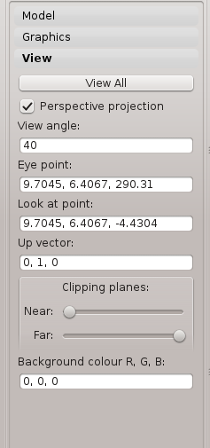

Visualisation
=============

This tutorial was created as part of the Computational Physiology module in the `MedTech CoRE <http://cmdt.org.nz>`_ Doctoral Training Programme. The tasks presented in this tutorial are designed to make the reader aware of common key visualisation skilss used in the context of computational physiology. We will demonstrate these skills across a range of spatial scales and visualisation techniques.

Overview
--------

A picture is worth a thousand words, as the saying goes so a four-dimensianal visualisation should be worth somewhere near one billion if not more.  That many words is difficult to comprehend let alone worry about their meaning.  So in visualisation we are trying to illustrate the complexities of an underlying biophysical data in a manner that is consumable by the target audience.  This tutorial is about the visualisations that we are currently able to produce and the aspects that are relevant to creating a visualisation from general or specific comsumption.

Task 1
------

In this task we shall investigate the capabilities of the visualisation tool on some existing models.  First we shall start with a script that will define a model and some initial graphics so that we can actually see something.  Start the view application with the following command (from the HOME directory)::

   python ~/projects/opencmiss-software/zinc-software/zincv/src/zincview.py

From the 'Model' toolbox click the load button and choose the heart.zincview.py file from the data directory.  The result should be something similar to :numref:`dtp_cp_vis_heart`.

.. _dtp_cp_vis_heart:
.. figure:: _images/heartvis.png
   :align: center
   :alt: Visualisation fo the heart image
   
   Visualisation of the Heart Model

Manipulating the View
.....................

We can manipulate the view with mouse actions, clicking and dragging with the mouse will transform the view.  The following table describes the mouse button to the transformation applied.

============ ==============
Mouse Button Transformation
============ ==============
Left         Tumble
------------ --------------
Middle       Pan/Translate
------------ --------------
Right        fly-zoom
------------ --------------
Shift+Right  Camera zoom
============ ==============

When we transform the view with the mouse you can see from the view pane the change in the camera controls (see :numref:`dtp_cp_vis_viewpane`).

Everything that can be seen is set inside what is known as the viewing frustrum.  The frustrum is a pyrimad shape with the top chopped off.  We look at the frustrum looking from the top through to the base of the pyramid.  The top of the pyramid is known as the near plane and the bottom is known as the far plane. Ideally we want to position the near plane just in front of everything that should be visible and position the far plane just behind everything that should be visible. The better job we do of this the better the hidden graphics removal will work, this is important when making large high-quality images.

.. _dtp_cp_vis_viewpane:

   
   View pane

Position the mouse over the near/far sliders [1] and use the mouse wheel to affect it - this will move the near/far planes in the scene.  When the near plane passes past the nearest object in the scene you will see part of it disappear, this is known as clipping.  The same phenomenon happens when the far plane passes the furtherest most object in the scene.  Adjusting the near and far plane can be used to see inside a closed surface or to create an effect when producing a movie.

We can also manipulate the viewing frustrum in other ways.  We have spoken about the viewing frustrum being a chopped pyramid, and this is true when we are viewing the scene in perspective projection.  But we can change this to an orthographic projection (sometimes called parallel projection) where the chopped pyramid becomes a cuboid.  Using the parallel/perspective control [2]  observe what effect this has on the scene.  Using the camera zoom zoom out in perspective mode and then fly-zoom back in to get an ultra-wide angle lens view.  At extremes the scene can look a little crazy, use the 'view all'  button [3] to reset the view.

From the 'Graphics' toolbox (see :numref:`dtp_cp_vis_graphicspane`) we can change the properties of the graphics.  We can change the visibility for instance, this can be done by checking and unchecking the check box next to the graphic name [1].  Another graphical aspect that we can easily change is the material used to colour the graphic.  The material can be changed with the material combobox [2], try selecting the surfaces in the graphics list [3] and setting the material to blue.

Point graphics are drawn using glyphs.  There are pre-defined glyphs that have already been created that can be used to produce interesting visualisations, sometimes a cube glyph is more appropriate representation of the data.  Select the 'node points' from the graphics list [3] and change the glyph to 'cube_solid'.  We can use the scaling to change the size of the glyph (and other graphics).  The final size of the scaled object is defined as::

   size = base_size + scaling*scale_field

If no scale field is set and the base size is zero then the graphics will be not be visible.

.. _dtp_cp_vis_graphicspane:
.. figure:: _images/graphicspane.png
   :align: center
   :alt: Graphics pane image
   
   Graphics pane

We can also add new graphics with the `add button` [4].  Add a 'point graphic', change the glyph for the new graphic to 'axes_xyz' and set the base size to 50.  This point graphic is representing the global x, y, z axes in the current scene.

The heart model contains data on the direction of the fibres within the heart wall, to visualise this we can add some more graphics.  Using the following instructions we can visualise the heart fibre direction::

   1. Add 'streamlines' using the Add combobox [3]
   2. Set the Streamlines vector field to 'fibres' using the Vector field combobox [8]
   3. Using the Shape combobox [9] set the shape to 'square extrusion'
   4. Set the base size to 1*0.2
   5. Set the sampling divisions to 1*3*1
   6. Set the Time length [10] value to 50

Here we have set the base size and sampling divisions using a special notation.  This notation allows us to set different values for different components, we can also just set one value which will be propagated across all components automatically.

It is often desirable to view the contours of the data, a contour is where the function has a constant value.  We can show contours through the heart wall volume.  To do this::

   1. Add a 'contour' graphic using the Add button [4]
   2. Set the value field to 'lambda'
   3. Set the iso value to 0.75

We can see now that the visualisation is getting quite busy.  To reduce some of the graphics visible we can try setting the exterior checkbox [5] on the surfaces.  The exterior checkbox allows us to only view the exterior surfaces of a volume.  This can be very useful especially when using transparent materials where we do not wish to show the construction of the mesh used for the model.

We can colour the graphics according to some data available in the model.  We will colour the surfaces with the lambda field to do this::

   1. Select the surfaces in the graphics list
   2. From the data combobox [6] choose the 'lambda' field

For the final rendering before we produce a publishable image we may decide that the background colour is not suitable for our target medium.  We can change the background colour one the view pane.  Using the view pane thingy box set the RGB values for the background colour, 1,1,1 will set the background colour to white for example.

We can also control the quality of the rendering via the refinement option on the rendering pane (:numref:`dtp_cp_vis_renderingpane`).  Use this control carefully it can take a long time to render highly refined graphics.  The circle divisions option controls the quality of spheres and cylinders.  Set the refinement factor to 10 and see the result.

.. _dtp_cp_vis_renderingpane:
.. figure:: _images/renderingpane.png
   :align: center
   :alt: Rendering pane
   
   Rendering pane

All of this visualisation is done through OpenGL and we can see what is actually being rendered by using the wireframe option [7] on the graphics pane (:numref:`dtp_cp_vis_graphicspane`).

Task 2
------
 
data/airways/AirwaysLobes.ex{node|elem}.

Steps:

#. Load nodes then elements (it’s a large model so doesn’t load instantly) and get attendees to create lines. They need to do view-all on the view tab to see them.
#. change the line shape to circle extrusion with scale by the ‘general’ field (a radius) with scaling 2 to make it a diameter.
#. zoom in to see the gaps between the line segments. Add nodes with sphere glyphs scaled by the same fields to close off the gaps.
#. colour by radius by picking general as the data field
#. on the data colouring tab. Click on autorange spectrum, try different ranges to make the image pretty. Add a colour bar. The colour bar appears in the list of graphics, but it uses some hidden attributes (not editable) to make it appear on top where it is. You can change the colour of the point graphics for the colour bar which affects its shininess and the colour of the labels. The colour bar is actually just a glyph, but it’s pretty silly to plot it at every node, for example, but it works!

   * (Alan  may be able to get another model with dependent fields by the time of the course, which will make it more interesting to visualise.)

#. [Alan needs to implement output of images here] From the output tab output a [hopefully hires] image of what’s on the screen, including colour bar, suitable for putting in your report.
 
Task 3
------

data/deforming_heart/deforming_heart.zincview.py
 
#. load the model which is similar to the heart in part 1 but has twice as many elements. It also defines strain fields and creates element point graphics which visualise mirrored glyphs to show principal strains: inward and red for compression, outward and blue for extension.
#. on the time pane, adjust the time slider to animate the model
#. zoom in and look at the deformation of parts of the tissue, the twisting of the ventricle etc.
#. change the glyph to arrow_solid (on all 3 element points) and line to see the difference.
#. advanced users may look at the script to see how these additional field are created by expressions; interest them in the possibilities of what they could visualise. They can also see how the time-varying model was loaded.
#. [Alan would have to implement]. Output to ThreeJS an animating, beating heart (probably no glyphs?)

Task 4
------
 
Ideally I would have liked to have got images into the rendering; I’m sure Alan could get the volume texture example going pretty quickly; can use that to segment part of the foot. Images combined with a model requires us to support multiple regions or groups, which I haven’t had time to do; adding a region chooser would be simplest I think, but probably no time. Could always draw image in another region (from the loading script) but wouldn’t be able to hide it.
 