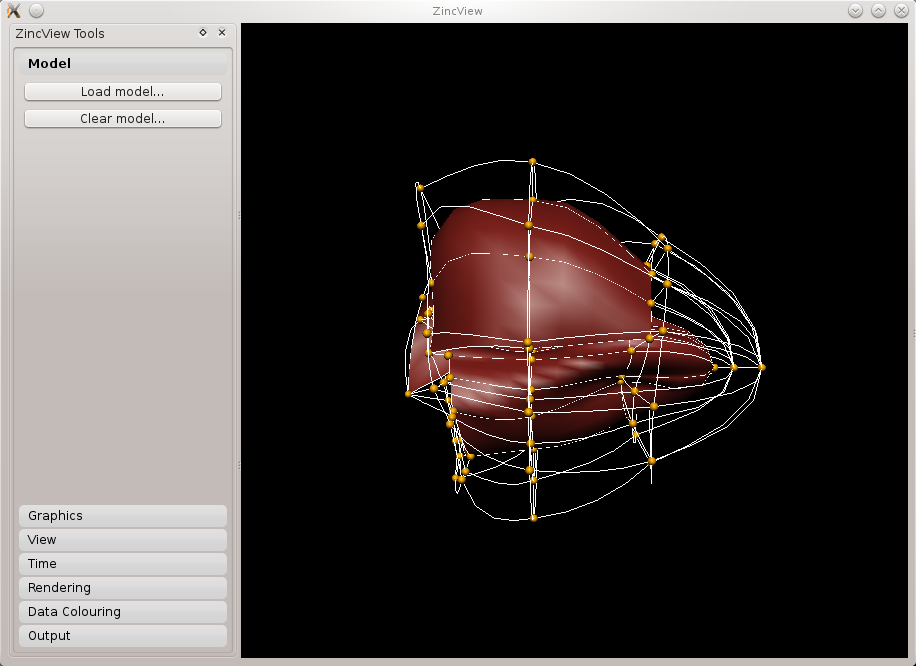

Visualisation
=============

This tutorial was created as part of the Computational Physiology module in the `MedTech CoRE <http://cmdt.org.nz>`_ Doctoral Training Programme. The tasks presented in this tutorial are designed to make the reader aware of key visualisation skills used in the context of computational physiology. We will demonstrate these skills across a range of spatial scales and visualisation techniques.

Overview
--------

Models, simulation results and image data in Computational Physiology are often three-dimensional, and may vary with time (or with other material or input parameters). We use visualisation to convert this raw modelling data into visual representations that illustrate the complexities of underlying biophysical behaviour in a manner that is consumable by the target audience.

This exploits humans' astounding visual capabilities, able to perceive three-dimensional objects and their spatial relationships from two-dimensional images of scenes with lighting/depth cues, possibly stereo, and often time variation.

Researchers need to perform interactive visualisation, alternately varying what is being spatially visualised and moving about the scene to view it from different distances and directions, and viewing changes with time. Such interaction is necessary to discover salient features in the dataset, since they may be deep within a 3-D model and hidden behind other structures, or happen in an instant of time.

One of the main challenges of visualisation is that typical output media such as documents and computer 
displays are inherently two-dimensional. We employ computer graphics rendering to make 2-D images 
from 3-D scenes, built up solely from point, line and triangle *primitives*. Visualisation algorithms are used to covert features of a model which may be any dimension into these primitives. Computer graphics rendering applies shading (colouring including with textures/images, lighting, translucency) to draw primitives as coloured pixels on the output image, and combined with the ability to vary time and viewpoint (at interactive speeds due to the enormous processing power of graphics hardware) gives the resulting output depth and communicates temporal changes.

Often the final objective is to output one or more static 2-D images, a movie or increasingly a shareable interactive 3-D visualisation. These outputs are used for papers and theses, presentations and general publicity. It can't be over-estimated how important it is to develop these visualisation skills when working in Computational Physiology, and how effective they are in communicating results and engaging with your audience: *pretty pictures sell research*.

SimpleViz tool
--------------

This tutorial uses the *SimpleViz* MAP client plugin for interactive visualisation. Each tutorial task uses a simple workflow consisting of a File Chooser for specifying a loading script (which loads a model and sets up some initial graphics) which is passed to the SimpleViz step, as shown in  :numref:`fig_dtp_cp_vis_simpleviz_workflow`:

.. _fig_dtp_cp_vis_simpleviz_workflow:

.. figure:: _images/simpleviz-workflow.png
   :align: center
   :figwidth: 80%
   :width: 75%

   Visualisation workflow using SimpleViz in the MAP client framework.

As the name suggests, SimpleViz presents a simplified interface for performing key aspects of interactive visualisation including results output. As shown in :numref:`fig_dtp_cp_vis_simpleviz_viewpage` its interface consists of a large 3-D graphics view and a toolbar with a series of pages for performing key functions. These are described in the following tutorial tasks, however it is hoped that many features will be obvious, and you are encouraged to *play* and *have fun*.

Task 1: Viewing
---------------

Open the *DTP-Visualisation-Task1* workflow and execute it. This loads the heart model construction visualisation in SimpleViz (from the model construction tutorial) as in :numref:`fig_dtp_cp_vis_simpleviz_viewpage`.

.. _fig_dtp_cp_vis_simpleviz_viewpage:
.. figure:: _images/simpleviz-viewpage.png
   :align: center

   Task 1 SimpleViz heart model construction visualisation, with view controls.

This is a made-up example for demonstrating how complex models are built out of simple shapes (finite elements), in this case cubes. Once you play around with it you will see how a good visualisation can explain complex behaviour with great efficiency.

The example supplies the coordinate locations of 60 elements at 4 times:

1. All elements converged to a single cube (time = 0.0)
2. The elements are exploded into a regular lattice and not connected (time = 0.2)
3. The elements are merged into a block mesh of 10x3x2 elements (time = 0.4). This stage shows that corners, edges and faces of touching elements have merged (except for those eventually on the right ventricle cavity -- these open up).
4. The block mesh is deformed into the heart model, merging into a ring where ends touch, closing the apex, and opening the right ventricle (time = 1.0)

At any time switch to the time page and move the time slider to animate the model which smoothly interpolates between the above times. Note that interpolation between times 0.4 and 1.0 is not appropriate for some outside elements which get very distorted, but it is good enough for this demonstration. The following section explains how to change your view of the model which you should be constantly doing when visualising models.

Manipulating the View
.....................

We can manipulate the view with mouse actions: clicking and dragging with the mouse in the graphics window area allows you to rotate, pan and zoom the view. The following table describes which mouse button controls which transformation.

============ ==============
Mouse Button Transformation
============ ==============
Left         Tumble/Rotate
------------ --------------
Middle       Pan/Translate
------------ --------------
Right        Fly Zoom
------------ --------------
Shift+Right  Camera Zoom
============ ==============

When we transform the view with the mouse you can see the corresponding settings change in SimpleViz' view page (see :numref:`fig_dtp_cp_vis_simpleviz_viewpage`). Note that Camera Zoom changes the angle of view but the eye doesn't move; if you make a very wide angle of view and then move in close, it is like looking through a very wide angle lens. Regular Fly Zoom moves the eye point closer to the lookat point. The Tumble/Rotate control rotates about an axis in the scene, like pulling on a tangent to a large sphere filling the window. Play with these controls until they make sense to you. If things start looking too weird, click the 'View All' button to restore a normal view.

In real life you can see from in front of your eyes to infinity, albeit not all in focus. In typical 3-D computer graphics everything is in focus, but you can only see a range of distances in front of your eye in the direction of the 'lookat point': between the near and far clipping plane distances. When you view the world in perspective mode (the default in SimpleViz), the part of space you see is called a *viewing frustum*, which is a pyramid seen from above but with its top chopped off at the near clipping plane. By turning off perspective you get a *parallel projection* where sizes of objects are unchanged by distance from the eye, like an extreme telephoto lens effect. Note that parallel projection uses the near and far clipping in exactly the same way.

Ideally we want to position the near plane just in front of everything that should be visible and position the far plane just behind everything that should be visible. The better the job we do of this the better the hidden graphics removal will work, which is important when making large high-quality, high-resolution images. SimpleViz sets the range more conservatively than this so that it doesn't need to change the ranges when objects are rotated out-of-plane. (You will notice in this example that multiple graphics drawn at the same depth appear to flash as they battle for which is in front and therefore seen. With lines and surfaces at the same depth the lines look like stitching; under the rendering page is a *perturb lines* option which brings the lines nicely in front; try it out.)

As their names suggest, the clipping planes can also be used to good effect in hiding graphics that are in the way of what we want to see. Here we will use them to gain an insight into what graphics are actually on the screen.

On the view page, drag the near clipping plane until close parts of the model disappear; when you are close you can hover over the slider and rotate the mouse wheel which moves it with more precision. Similar clipping occurs if you zoom in close enough to the model since you can't see things behind you. The far clipping plane has a similar effect on the far side of the view.

With the front part of the model being clipped, rotate the view: you will see all the elements are hollow! This reinforces that only points, lines and triangles (surfaces) are ever drawn in computer graphics. Have a look at the list of graphics under the graphics page: it consists of lines (generated from the 1-D edges of the 3-D cube elements) and surfaces (generated from the 2-D faces of the 3-D cubes). You can assure yourself that the elements are 3-D by making other graphics such as elements points that are calculated in its interior; you'll need to hide the surfaces by un-checking the box next to the surfaces graphics on the list.

For the rest of this task use the viewing controls to look closely at how the bottom of the heart is merged to form an apex, and generally how the initially cube-shaped elements are distorted to make a physically realistic shape.

Task 2: Graphics and Print Output
---------------------------------

In this task we shall investigate the capabilities of the visualisation tool on some existing models.  First we shall start with a script that will define a model and some initial graphics so that we can actually see something.  Start the view application with the following command (from the HOME directory)::

   python ~/projects/opencmiss-software/zinc-software/zincv/src/zincview.py

From the 'Model' toolbox click the load button and choose the heart.zincview.py file from the data directory.  The result should be something similar to :numref:`dtp_cp_vis_heart`.

.. _dtp_cp_vis_heart:

   
   Visualisation of the Heart Model

From the 'Graphics' toolbox (see :numref:`dtp_cp_vis_graphicspane`) we can change the properties of the graphics.  We can change the visibility for instance, this can be done by checking and unchecking the check box next to the graphic name [1].  Another graphical aspect that we can easily change is the material used to colour the graphic.  The material can be changed with the material combobox [2], try selecting the surfaces in the graphics list [3] and setting the material to blue.

Point graphics are drawn using glyphs.  There are pre-defined glyphs that have already been created that can be used to produce interesting visualisations, sometimes a cube glyph is more appropriate representation of the data.  Select the 'node points' from the graphics list [3] and change the glyph to 'cube_solid'.  We can use the scaling to change the size of the glyph (and other graphics).  The final size of the scaled object is defined as::

   size = base_size + scaling*scale_field

If no scale field is set and the base size is zero then the graphics will be not be visible.

.. _dtp_cp_vis_graphicspane:
.. figure:: _images/graphicspane.png
   :align: center
   :alt: Graphics pane image
   
   Graphics pane

We can also add new graphics with the `add button` [4].  Add a 'point graphic', change the glyph for the new graphic to 'axes_xyz' and set the base size to 50.  This point graphic is representing the global x, y, z axes in the current scene.

The heart model contains data on the direction of the fibres within the heart wall, to visualise this we can add some more graphics.  Using the following instructions we can visualise the heart fibre direction::

   1. Add 'streamlines' using the Add combobox [3]
   2. Set the Streamlines vector field to 'fibres' using the Vector field combobox [8]
   3. Using the Shape combobox [9] set the shape to 'square extrusion'
   4. Set the base size to 1*0.2
   5. Set the sampling divisions to 1*3*1
   6. Set the Time length [10] value to 50

Here we have set the base size and sampling divisions using a special notation.  This notation allows us to set different values for different components, we can also just set one value which will be propagated across all components automatically.

It is often desirable to view the contours of the data, a contour is where the function has a constant value.  We can show contours through the heart wall volume.  To do this::

   1. Add a 'contour' graphic using the Add button [4]
   2. Set the value field to 'lambda'
   3. Set the iso value to 0.75

We can see now that the visualisation is getting quite busy.  To reduce some of the graphics visible we can try setting the exterior checkbox [5] on the surfaces.  The exterior checkbox allows us to only view the exterior surfaces of a volume.  This can be very useful especially when using transparent materials where we do not wish to show the construction of the mesh used for the model.

We can colour the graphics according to some data available in the model.  We will colour the surfaces with the lambda field to do this::

   1. Select the surfaces in the graphics list
   2. From the data combobox [6] choose the 'lambda' field

For the final rendering before we produce a publishable image we may decide that the background colour is not suitable for our target medium.  We can change the background colour one the view pane.  Using the view pane thingy box set the RGB values for the background colour, 1,1,1 will set the background colour to white for example.

We can also control the quality of the rendering via the refinement option on the rendering pane (:numref:`dtp_cp_vis_renderingpane`).  Use this control carefully it can take a long time to render highly refined graphics.  The circle divisions option controls the quality of spheres and cylinders.  Set the refinement factor to 10 and see the result.

.. _dtp_cp_vis_renderingpane:
.. figure:: _images/renderingpane.png
   :align: center
   :alt: Rendering pane
   
   Rendering pane

All of this visualisation is done through OpenGL and we can see what is actually being rendered by using the wireframe option [7] on the graphics pane (:numref:`dtp_cp_vis_graphicspane`).

Task 2
------

.. _fig_dtp_cp_vis_simpleviz_graphicspage_heart:

.. figure:: _images/simpleviz-graphicspage-heart.png
   :align: center
   :figwidth: 95%
   :width: 90%

   Task 2 SimpleViz graphics page showing decorated heart model.

Task 2
------
 
data/airways/AirwaysLobes.ex{node|elem}.

Steps:

#. Load nodes then elements (it’s a large model so doesn’t load instantly) and get attendees to create lines. They need to do view-all on the view tab to see them.
#. change the line shape to circle extrusion with scale by the ‘general’ field (a radius) with scaling 2 to make it a diameter.
#. zoom in to see the gaps between the line segments. Add nodes with sphere glyphs scaled by the same fields to close off the gaps.
#. colour by radius by picking general as the data field
#. on the data colouring tab. Click on autorange spectrum, try different ranges to make the image pretty. Add a colour bar. The colour bar appears in the list of graphics, but it uses some hidden attributes (not editable) to make it appear on top where it is. You can change the colour of the point graphics for the colour bar which affects its shininess and the colour of the labels. The colour bar is actually just a glyph, but it’s pretty silly to plot it at every node, for example, but it works!

   * (Alan  may be able to get another model with dependent fields by the time of the course, which will make it more interesting to visualise.)

#. [Alan needs to implement output of images here] From the output tab output a [hopefully hires] image of what’s on the screen, including colour bar, suitable for putting in your report.
 
Task 3
------

data/deforming_heart/deforming_heart.zincview.py
 
#. load the model which is similar to the heart in part 1 but has twice as many elements. It also defines strain fields and creates element point graphics which visualise mirrored glyphs to show principal strains: inward and red for compression, outward and blue for extension.
#. on the time pane, adjust the time slider to animate the model
#. zoom in and look at the deformation of parts of the tissue, the twisting of the ventricle etc.
#. change the glyph to arrow_solid (on all 3 element points) and line to see the difference.
#. advanced users may look at the script to see how these additional field are created by expressions; interest them in the possibilities of what they could visualise. They can also see how the time-varying model was loaded.
#. [Alan would have to implement]. Output to ThreeJS an animating, beating heart (probably no glyphs?)

Task 4
------
 
Ideally I would have liked to have got images into the rendering; I’m sure Alan could get the volume texture example going pretty quickly; can use that to segment part of the foot. Images combined with a model requires us to support multiple regions or groups, which I haven’t had time to do; adding a region chooser would be simplest I think, but probably no time. Could always draw image in another region (from the loading script) but wouldn’t be able to hide it.
 